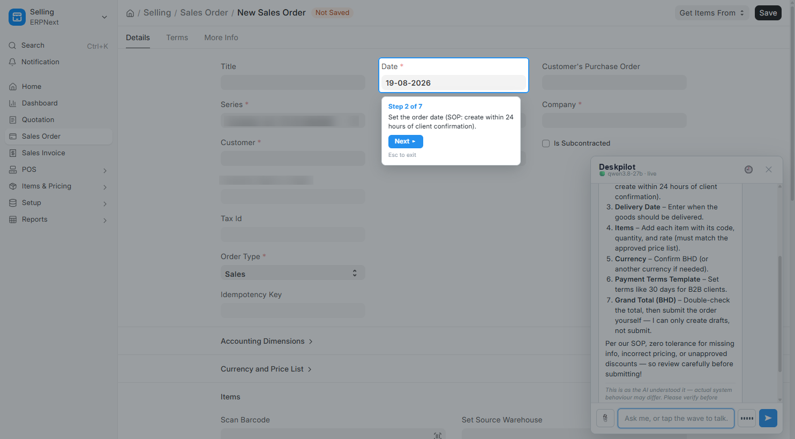
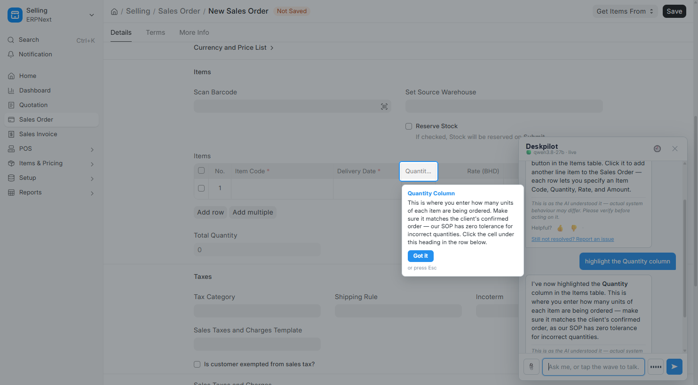
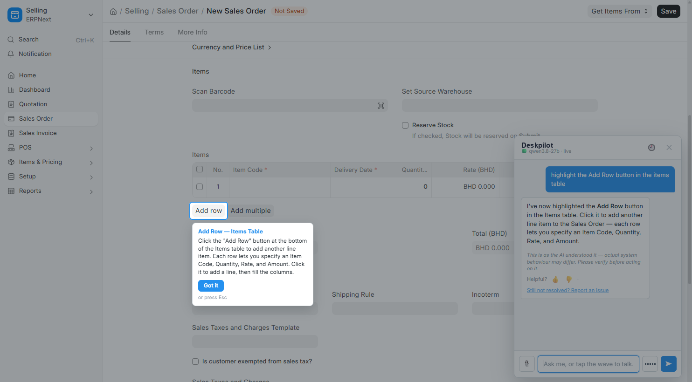
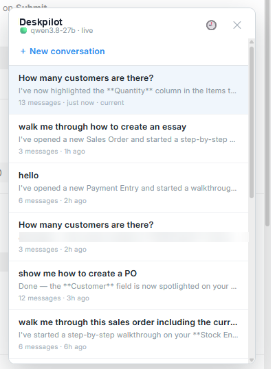

# Deskpilot

An in-Desk assistant for **ERPNext / Frappe v15–v16**. It answers questions about live data,
*drives the screen* — spotlights a field, opens a list, walks a user through a form step by step —
fills in new documents for you to save yourself, and cites your own SOPs.

Runs against any OpenAI-compatible chat endpoint (vLLM, Ollama, llama.cpp, or a hosted API).
No data leaves your network unless you point it at a hosted model.

<p align="center">
  
</p>

---

## Why this exists

Most ERP assistants are a chat box bolted to the side. Users do not get stuck because they lack
prose — they get stuck because they do not know *which field on this screen* to fill in next. So
this one points at the screen, and its design assumption is that **the model will lie about having
done so** unless the runtime stops it.

| | |
|---|---|
| **Answers are tool-derived** | A figure with no data-tool call in the same turn triggers a corrective round, then a refusal. The model does not get to remember your customer count. |
| **Saying is not doing** | "I've highlighted the Customer field" with no action emitted is caught and corrected, not shipped. |
| **Permissions are real** | Every call runs as the asking user, including in the background worker. Counts are permission-filtered — a user who cannot read Salary Slip cannot learn how many there are. |
| **It cannot write** | It has no tool that writes to the database — no save, submit, amend or cancel. Asked to create something it opens the new form and fills what you gave it; *you* press Save. |

## What it looks like

| Guided walkthrough | Line-item precision |
|---|---|
|  |  |
| Steps are resolved against the doctype metadata server-side, so each one points at the real field — expanding collapsed sections and switching tabs as needed. | "Highlight the Quantity column" lands on the column heading *inside the child table*, not the form's Total Quantity field. |

| Controls, not just fields | Conversations |
|---|---|
|  |  |
| "Add Row" is a control, not a field — it maps to the grid's own add-row button. | Per-user sessions, titled from the first message. Resume any of them. |

Closing it leaves a dormant ghost that fills in on hover, rather than vanishing with no way back:


> Screenshots are redacted — see [docs/img/README.md](docs/img/README.md) for what and why.

## Install

```bash
cd $PATH_TO_YOUR_BENCH
bench get-app https://github.com/mdad-elec/deskpilot
bench --site your-site.local install-app deskpilot
```

Open the Desk. If you are a System Manager and setup has not been completed, the assistant offers
its setup wizard once. You can also reach it any time from **Deskpilot > Deskpilot Settings >
Run setup wizard**.

The wizard walks four steps:

1. **Connect a model** — it will not let you continue until it has made a real call to your
   endpoint and shown you the reply.
2. **Who can use it** — a role gate, plus who receives reported problems.
3. **Where are your documents** — a Frappe folder or a Google Drive folder, with a *Sync now*
   button that tells you how many chunks were actually indexed.
4. **Make it yours** — name, greeting, avatar.

## Configuration

Everything lives in **Deskpilot Settings** (System Manager only). Each setting can also be pinned
in `site_config.json` with a `deskpilot_` prefix — useful for seeding a site from automation, or
for holding a value an administrator should not be able to change from the Desk. Resolution order
is **Settings → `site_config.json` → built-in default**.

| Tab | What matters |
|---|---|
| **Model** | Provider, base URL, key, model. Token and time budgets. `max_answer_tokens` is load-bearing — see *Traps*. |
| **Embeddings** | Must be a **separate endpoint** from the chat model. See *Traps*. |
| **Knowledge** | Document source, the shared-MCP option, and the two retrieval filters. |
| **Appearance** | Name, greeting, avatar. |
| **Access** | Required role, issue assignees, transcript retention. |

One asymmetry worth knowing: for checkboxes, the Settings value always wins, including when
unticked. For every other field, blank means "fall through". This is deliberate — otherwise a flag
switched on in `site_config.json` could never be switched off from the UI.

### Documents

**Frappe Files** (default) — pick a folder in the Desk. Everything under it is indexed hourly,
delta by modification time, and a file removed from the folder is removed from the index.

**Google Drive** — needs **Google Settings** (client ID and secret) configured on your site first,
then *Connect Google Drive* in Deskpilot Settings. Google Docs are exported as markdown so their
heading structure survives into the chunker.

> **The knowledge base is shared.** Anything indexed is answerable to every user who can reach the
> assistant, including files marked private. Point it at a folder of approved process documents,
> not at Home. Use **Blocked topics** for material that is need-to-know.

## Traps

These each cost real debugging time. They are documented in the source too.

- **The embedding endpoint must not be the chat endpoint.** Point both at one server that only
  serves a chat model and every embedding 404s. The failure is swallowed by design — retrieval
  degrades rather than erroring — so it presents as "the knowledge base just stopped working",
  with nothing in the logs. The Settings form warns if you set them the same.
- **`max_answer_tokens` is not a cost knob.** Set it too low and answers truncate mid-sentence; a
  truncated *tool call* is discarded entirely, so the symptom is the assistant silently doing
  nothing rather than a short reply.
- **A role gate you do not hold locks you out too.** The gate is enforced server-side on every
  endpoint. If you set **Required role** to a role you lack, the widget disappears for you as
  well — the setup wizard is still offered to System Managers for exactly this reason.
- **Bump `?v=` when you change `copilot.js`.** The asset is served with no `Cache-Control` header,
  so browsers heuristically cache it and users keep running the old widget after a deploy.
- **Scheduled jobs need a migrate.** `scheduler_events` only becomes live Scheduled Job Type rows
  after `bench --site <site> migrate`.

## Development

```bash
python3 -m unittest discover -s tests   # hermetic: no bench, no site, no database
ruff check .
python3 scripts/check_refs.py           # every dotted path in hooks.py/patches.txt resolves
python3 scripts/check_branding.py
```

`scripts/check_refs.py` exists because a dotted path in `hooks.py` or `patches.txt` that does not
resolve kills `bench install-app` — but only on a clean machine. On a box that still has the old
files lying around outside git, everything keeps working, so the breakage is invisible exactly
where it is being developed and total for everyone else.

## License

MIT — see [LICENSE](LICENSE).
